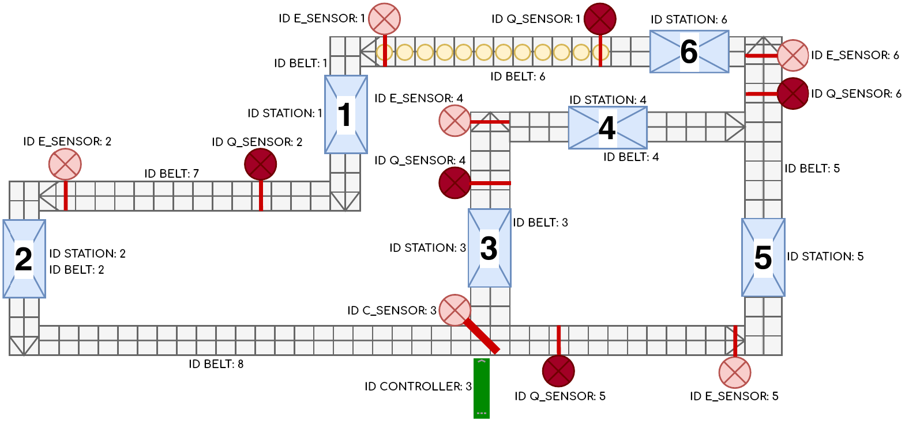

<h1>FM Homework</h1>

[![License: MIT][license-image]][license]

This is the homework that replaces the entire exam of **"Formal Methods for Concurrent and Real-Time Systems"**, course of **"Computer Science and Engineering"** (MSc) held at Politecnico di Milano (2022/2023).

**Professor**: Pierluigi San Pietro

**Final Score**: 30 cum laude / 30

<h2>Homework specification</h2>

The system under consideration is a Lego Mindstorms Production Plant, which is a simplified replica of an actual production plant constructed entirely using Lego pieces.
Its primary function is to transport pieces along conveyor belts.
Sensors detect these pieces, which are then temporarily held in designated spaces that simulate processing stations.
Pieces circulate within the plant indefinitely, continuously transitioning between different conveyor belts without a predetermined end.

<h2>Objective</h2>

The objective of the project is to develop a digital twin of this system.
This replication will be accomplished using the Uppaal model checking program (v5.0.0).
Through this program, the system needs to be modeled by defining templates composed of timed automata and their associated functions (written in a simplified version of C++).
During and after the modeling phase, it is essential to define and verify properties using the verifier.

<h2>Copyright and license</h2>

This project is copyright 2023.

Licensed under the **[MIT License][license]**; you may not use this software except in compliance with the License.

[license]: https://github.com/christian-confalonieri/Formal-Methods-for-Concurrent-and-Real-Time-Systems-2022-2023/blob/main/LICENSE
[license-image]: https://img.shields.io/badge/License-MIT-blue.svg
